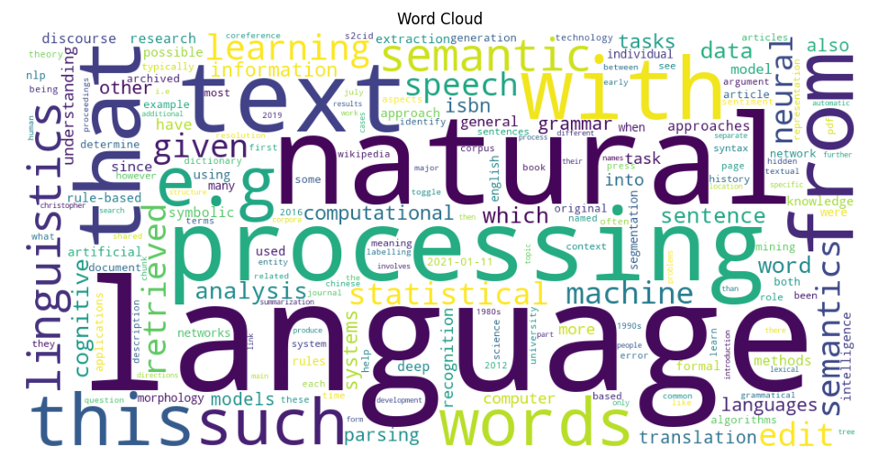

# CC2.2: Text Preprocessing -- Phase 1: Start and Run

[](#)
[](./LICENSE)

Professional Python project for Web Mining and Applied NLP.

## Example Output Artifact



## Assignment Updates

## Assignment Goal

Set up the project, run the example text preprocessing pipeline, review the code, and submit your updated work.

## Project Scope

- Notebook exploration: notebooks/text_preprocessing_case.ipynb
- Python module: src/nlp/text_preprocessing_case.py
- Project metadata: pyproject.toml and zensical.toml
- Input data: data/text_data_case.txt

## Steps to Complete the Assignment

1. Clone your repository and open it in VS Code.
2. Set up the environment and dependencies with uv.
3. Install pre-commit hooks and run checks.
4. Run the example module.
5. Open the notebook, select the kernel, and run all cells.
6. Update authorship and repository metadata.
7. Make one technical modification and verify it still runs.
8. Commit and push your changes.

## Commands

Run from the project root.

```shell
uv self update
uv python pin 3.14
uv sync --extra dev --extra docs --upgrade

uvx pre-commit install
git add -A
uvx pre-commit run --all-files

uv run python -m nlp.text_preprocessing_case

uv run ruff format .
uv run ruff check . --fix
uv run zensical build

git add -A
git commit -m "complete assignment"
git push -u origin main
```

## Completion Checklist

- Pipeline runs successfully.
- Notebook runs end-to-end.
- Metadata is updated with your information.
- Pre-commit checks pass.
- Changes are pushed to GitHub.


# CC2.2: Text Preprocessing -- Phase 2: Change Authorship

## Pull Code from GitHub
Open project repository in VS Code and a new terminal.

```shell
git pull origin main
```

## Update Authorship and Repository References

✅ Authorship Updated Across All Files:

- zensical.toml — Site, repo, and social links point to Angie-Crews
- LICENSE — Added Angie Crews as copyright holder
- CITATION.cff — Angie Crews listed as primary author
- text_preprocessing_case.ipynb — Author and repo links updated
- GitHub About section — Linked to your GitHub Pages site
- README.md - Username to Angie-Crews

## Run the Project Code

- Activate VS Code Interpreter
  - Command Palette
  - Python: Select Interpreter
  - Choose recommended local .venv
- Set Auto Save Option
- Run the Python File
```shell
uv run python src/nlp/text_preprocessing_case.py
```
- Update Project README.md with process steps and commands

Add or update Dependencies (In the Project Root Folder)
```shell
uv cache clean
uv sync --extra dev --extra docs --upgrade
```
Run Checks and Tests
```shell
uv run ruff format .
uv run ruff check . --fix
uv run pytest --cov=src --cov-report=term-missing
```
## Build Documenation
```shell
uv run zensical build
uv run zensical serve
```

Save work frequently!

## Git Add-Commit-Push to GitHub

```shell
git add -A
git commit -m "update"

git add -A
git commit -m "update"

git push -u origin main
```

# CC2.2: Text Preprocessing -- Phase 3: Read and Understand the Example Project

Professional Practice
- Before modifying a project, first read and understand how it works.
- Professional developers often explore a project in a consistent order: documentation, code, data, and outputs.
- Focus on the overall flow of the project. It's not necessary to understand every line of code at this point.

Professional Project Organization
- Real-world projects contain many files, so most professional projects follow a predictable organization.

Folder Naming Conventions
- When referring to a folder in documentation, a / is often added to the name. For example, data/.
- The slash is not part of the folder name - it just indicates a folder.

Goal -- By the end of this phase you should understand:
- the purpose of the project
- the main tools or techniques used
- how data flows through the program

Suggested Reading Order
- README.mnd (root project folder)
- Documentation (docs/)
- Notebooks and Source Code (notebooks/ and src/)
  - Jupyter notebooks run top to bottom
  - Python
    - locate the main() function
    - observe which functions are called
    - follow how information flows through the program
    - note what is passed to each function as arguments (inside the parentheses)
- Data (data/)
- Outputs (artifacts/ or output/)
- Log File (project.log)

Example code chosen

```shell
print("First 5 text records:")
for line in text_list[:5]:
    print("-", line)

print(f"\nLoaded {len(text_list):,} text records.")
print(f"Raw text length: {len(raw_text):,} characters")

print("\nFirst 500 characters of combined text:")
print(raw_text[:500])
```
Why: It shows both correct coding and clear communication in one line. It calculates a useful number, formats it to be easy to read, and labels it so others can quickly understand the results.

What can you do with these skills: These skills help you quickly check data, clean it consistently, and turn text into reliable insights. They also help you communicate results clearly so others can understand and trust your work.

# P2: Text Preprocessing -- Phase 4: Make a Technical Modification

## Pull Code from GitHub
```shell
git pull origin main
```

## Technical Modification Summary

This phase includes multiple technical modifications in my `_crews` files.

What I changed:
- Changed the input dataset to a chocolate-focused corpus in `data/text_data_crews.txt`.
- Updated the script and notebook to use the new input file:
  - `src/nlp/text_preprocessing_crews.py`
  - `notebooks/text_preprocessing_crews.ipynb`
- Expanded the stop word list by adding:
  - `not`, `this`, `also`, `more`, `into`, `back`, `been`, `than`, `such`, `very`
- Kept the frequency table output and top-token analysis.
- Changed visual outputs to match the chocolate topic:
  - Section 10 now uses a lollipop chart for top terms.
  - Section 11 now uses a donut chart for token-stage share.

Why I made these changes:
- To make the project output domain-specific (chocolate) instead of generic sample text.
- To reduce low-information words and improve token quality.
- To create more engaging and interpretable charts for presentation.

What I observed after running:
- The project runs successfully with:
  - `uv run python -m nlp.text_preprocessing_crews`
- The notebook runs end-to-end with the updated charts.
- Top tokens now reflect chocolate-focused vocabulary.
- Expanded stop words reduce noise in the cleaned token list.
- The lollipop chart makes token ranking easy to compare, and the donut chart clearly shows stage proportions.

## Files Modified for Phase 4

- `data/text_data_crews.txt`
- `src/nlp/text_preprocessing_crews.py`
- `notebooks/text_preprocessing_crews.ipynb`
