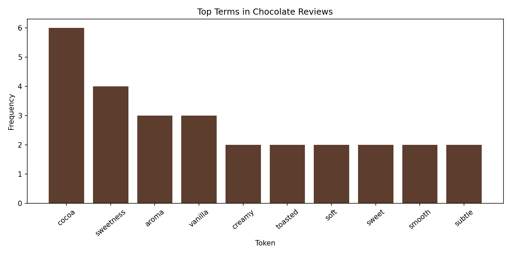
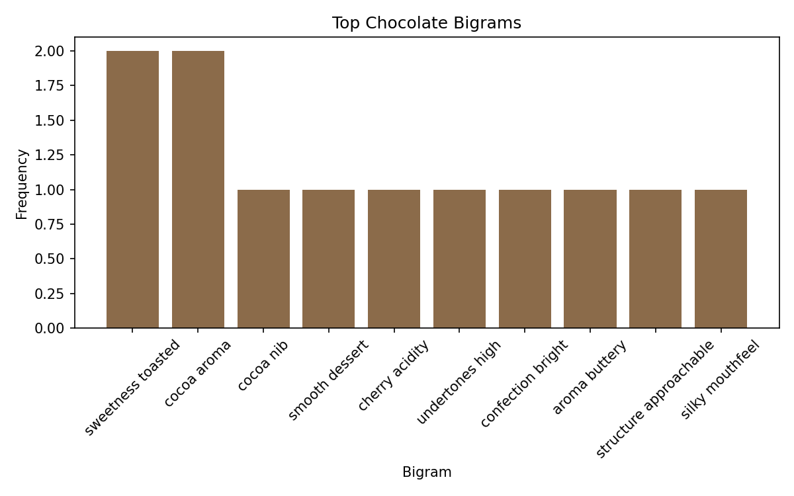

# Phase 5 Project Story

## New Problem Context

In Phase 5, the project expands the chocolate work from Phase 4.

Instead of only counting top words in one corpus, this phase analyzes how language differs across chocolate types and identifies common two-word flavor phrases.

- Dataset: `data/text_data_phase5.txt`
- Script: `src/nlp/text_preprocessing_phase5.py`
- Notebook: `notebooks/text_preprocessing_phase5.ipynb`

## What Was Applied

The same core pipeline from the example project was reused and adapted:

1. Read and inspect raw text records.
2. Parse `type|review` records for dark, milk, and white chocolate.
3. Normalize by lowercasing.
4. Remove punctuation using regex.
5. Remove stop words and short tokens.
6. Build a frequency table with Polars.
7. Compare top tokens by chocolate type.
8. Build bigram frequencies (two-word phrases).
9. Visualize token and bigram results.

## Key Results

The cleaned tokens emphasize flavor and sensory vocabulary, including terms like `cocoa`, `sweetness`, `creamy`, and `vanilla`.

### Token Count Summary

| Stage | Count |
|---|---:|
| Raw tokens | 143 |
| After punctuation removal | 145 |
| After stop word removal | 95 |

This represents a reduction of approximately 33.6% from raw to cleaned tokens.

### Visualization

These charts show both the strongest standalone terms and the most frequent flavor phrases.

## Why This Demonstrates Independent Application

This phase goes beyond reproducing the original example by:

- extending Phase 4 in the same domain with a richer dataset,
- adding type-based comparison logic,
- introducing phrase-level analysis with bigrams,
- and answering a new analytical question:
  How do flavor and quality terms differ across dark, milk, and white chocolate reviews?
